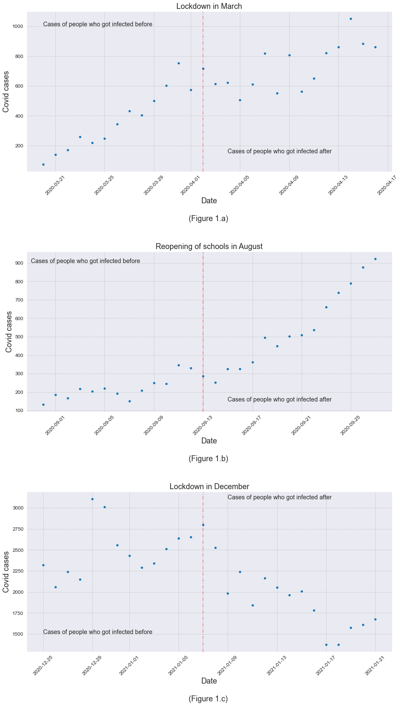
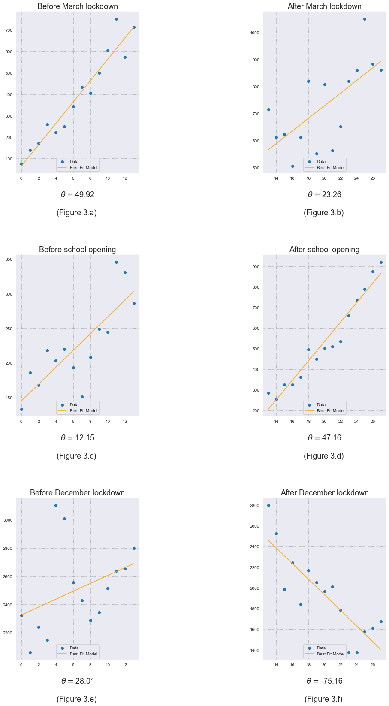
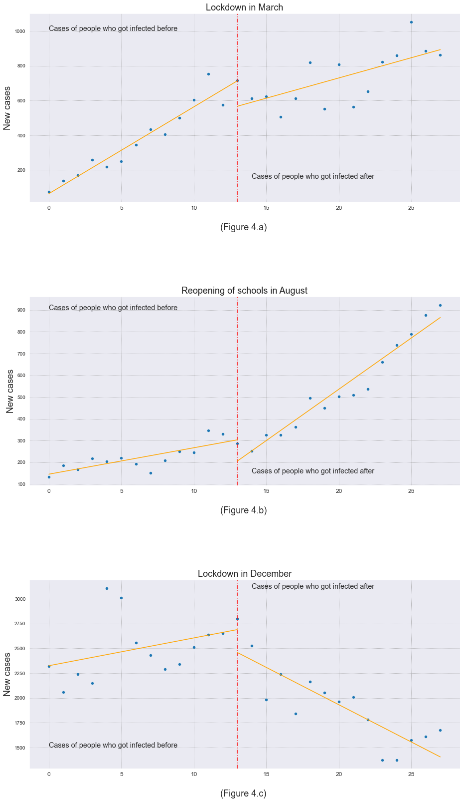

# Description:

Governments all over the world took multiple approaches to dealing with the Covid-19 pandemic. Some forced lockdowns, stopped schools, prohibited public gatherings, etc...

We will analyze whether these decisions actually proved useful in dealing with the pandemic in Quebec, Canada and explain how it did or didn't affect the cases of people getting infected with Covid-19. 

We will take into consideration three of the major events in Quebec:

<ul>
    <li>The lockdown on March 20th, 2020</li>
    <li>The reopening of schools in August 31st, 2020</li>
    <li>The lockdown on December 25th, 2020</li>
</ul>

According to CDC, symptoms may appear 2-14 days after exposure to the virus. Therefore we will assume that all new cases have been reported after 14 days of being infected with the virus.

Hence our thresholds will be:

<ul>
    <li>April 2nd, 2020</li>
    <li>September 13th, 2020</li>
    <li>January 7th, 2021</li>
</ul>

We will use a time window of two weeks to observe the number of new cases before and after the threshold. This means that the first window will inform us of the Covid-19 cases prior to the event while the second window will inform us of the Covid-19 cases after the event took place.

source : https://www.cdc.gov/coronavirus/2019-ncov/symptoms-testing/symptoms.html

## Graphing Data:

In order to further understand the data we are dealing with, we will plot scatterplots to observe the trends and boxplots to observe the quantile variation of our new Covid-19 cases.

</img>

### Initial Observation:

<ul>

   <li>
       Figure 1.a : We observe that we have an increase in the number of Covid Cases before and after the lockdown. However we would require further analysis to observe the rate of these cases.
   </li>
     
   <li>
       Figure 1.b : We observe a shy increase of Covid cases before the opening schools followed by a steep and severe increase in the number of Covid cases after schools reopened.
   </li>
     
   <li>
       Figure 1.c : We observe an instable variation of increasing and decreasing of Covid cases before the lockdown. However we observe a stable decrease in the Covid cases after the lockdown took place.
   </li>
    
</ul>

Of course jumping into conclusions would be naive blunder. We will further subset the data of each event into two seperate parts. We will create two subsets for each event describing the Covid-19 cases before `(pre)` and after `(post)` the event took place.

## Boxplots:

In order to properly visualize the boxplots we will have to concatenate the `pre` and `post` subsets of each event respectively. We will assign those flags into a new column `Period` to indicate if the associating date is before or after the event.

#### Boxplot analysis:

<ul>
    <li>
        Figure 2.a: We can see that both events have normal distributions since the median is very close to the middle of the box. We can also observe that the (Pre) event has much more dispersed data as opposed to the less dispersed data of the (Post) event.
    </li>
     
    <li>
        Figure 2.b: We can see that (pre) event has somewhat of a normal distribution since the median is very close to the middle of the box.However (Post) event is right skewed data which means that the mean is greater than the median and overestimates the most common values in a positively skewed distribution. There one visible outlier in the (pre) event .We can also observe that the (Post) event has much more dispersed data as opposed to the less dispersed data of the (Pre) event.
    </li>
     
    <li>
        Figure 2.c: We can see that both events have normal distributions since the median is very close to the middle of the box. We can also observe that the (Post) event has much more dispersed data as opposed to the less dispersed data of the (Pre) event.
    </li>
</ul>

## Modeling:

After taking a closer look at our data and understanding the distributions of each event. We will attempt to establish a best fit model to help understand the regression difference between the two time windows of each event.

We start by using a proxy for the Date to help us build our model and track the cases of Covid-19 much easier.

We will attempt to find a best fit model for each period of every event and observe the difference in coefficients which will be denoted by &#952;

</img>

#### Observation:

<ul>

   <li>
       March Lockdown: We notice that the rate before the lockdown was increasing by almost 50 cases per day. However, after the lockdown, we still had an increase in the number of cases but with a much less rate of 23 people per day.
   </li>
    
   <li>
       School Lockdown: We notice that the rate before the schools opening was increasing by almost 12 cases per day. However, after the lockdown, we still had a severe increase in the number of cases with a much higher rate of 47 people per day.
   </li>
    
   <li>
       December Lockdown: This is by far the best results we obtained. We notice that the rate before the lockdown was increasing by almost 28 cases per day. However, after the lockdown, we started observing a decrease in the number of cases with an impressive rate of 75.
   </li>
    
    
</ul>

# Putting it all together:

</img>

# Conclusion:

It is important to note that there are certainly other factors affecting the cases of Covid-19. However, it is safe to assume that the measures taken by the government of Quebec have proven to have a significant correlation with the number of cases. It is common sense that lockdowns will not prevent the spread of Covid-19 completely but it will slow it down as we observed. It is also reasonable that the number of cases would skyrocket after schools opening since children are the most dangerous carriers because of their interaction with each other in schools which later translates into their households.